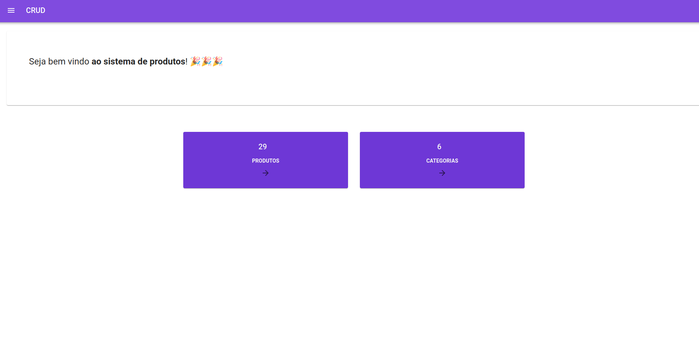
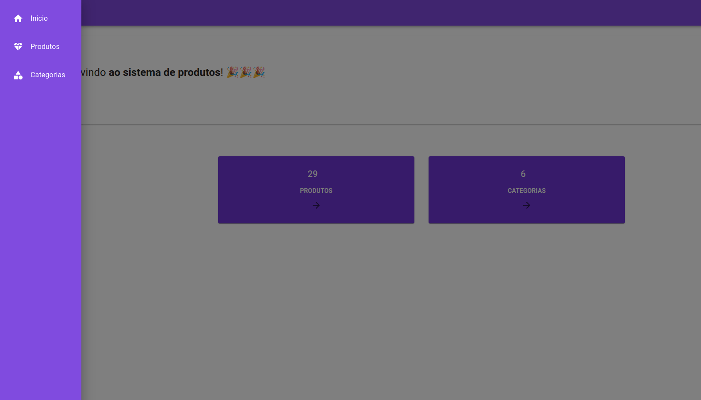
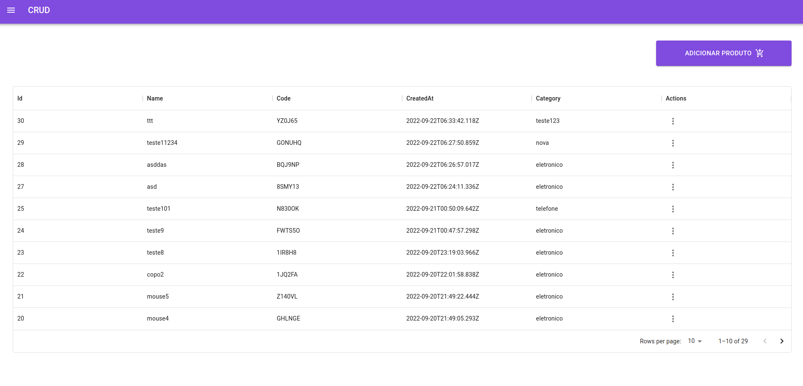
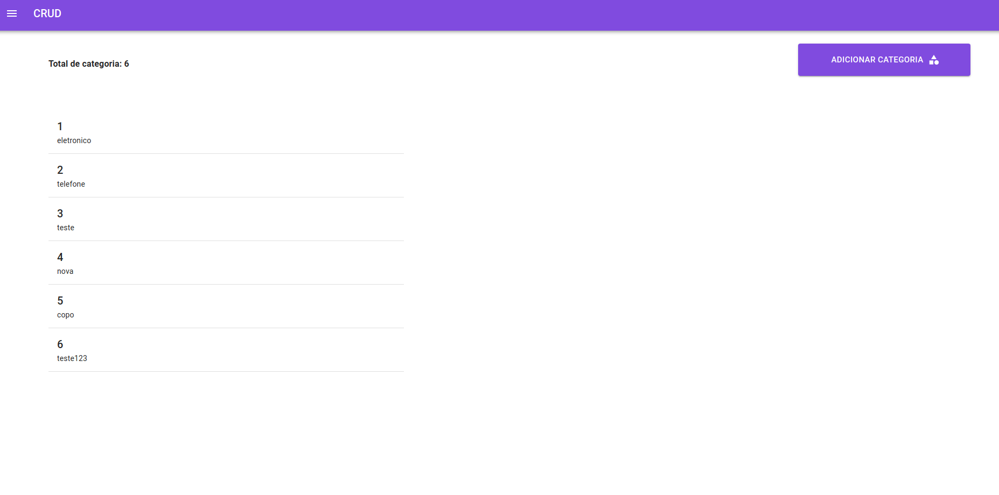

<!-- PROJECT -->
<br />
<p align="center">
  <h2 align="center">Teste desenvolvedor Fullstack</h2>

  <p align="center">
    Implementar API com NodeJs de um CRUD de produtos e categorias usando banco de dados relacional.
    <br />
    Implementar o frontend em React de um CRUD de produtos e categoria.
  </p>
</p>

### Tecnologias Utilizadas

O projeto foi criado usando as tecnologias:

- [Typescript]
- [React/Vite]
- [MUI/MaterialUI]
- [react-query]
- [yup]

<!-- GETTING STARTED -->

A seguir estão as instruções para a instalação, configuração e uso do projeto.

### Configurando

1. Criar um arquivo na raiz do projeto, chamado [.env].

2. Copiar o conteúdo do arquivo [.env.example] e setar com as configurações do seu banco de dados e a URL da aplicação.

### Instalando

1. Clonar o repositório

```sh
   git clone https://github.com/rodolfowolff/crud-vite.git
```

2. Instalando os pacotes

```sh
    npm install
```

3. Variaveis de ambiente, altere caso necessário a url e porta da API no arquivo .env

```sh
VITE_PUBLIC_API='http://localhost:4000/'
```

4. Executar localmente

```sh
    npm run dev
```

### Rodando aplicação localmente

No navegador, digitar <a href="http://localhost:5173/">http://localhost:5173/</a>.

<!-- LINKS -->

### API link do projeto

<a href="https://github.com/rodolfowolff/API-graphql-apollo-prisma">https://github.com/rodolfowolff/API-graphql-apollo-prisma</a>

## Imagens

<!-- IMAGES -->
<p align="center">
  
  
  
  
</p>

<!-- CONTACT -->

## 🐺 👨‍💻 Desenvolvedor

- [Rodolfo Wolff](https://github.com/rodolfowolff)
